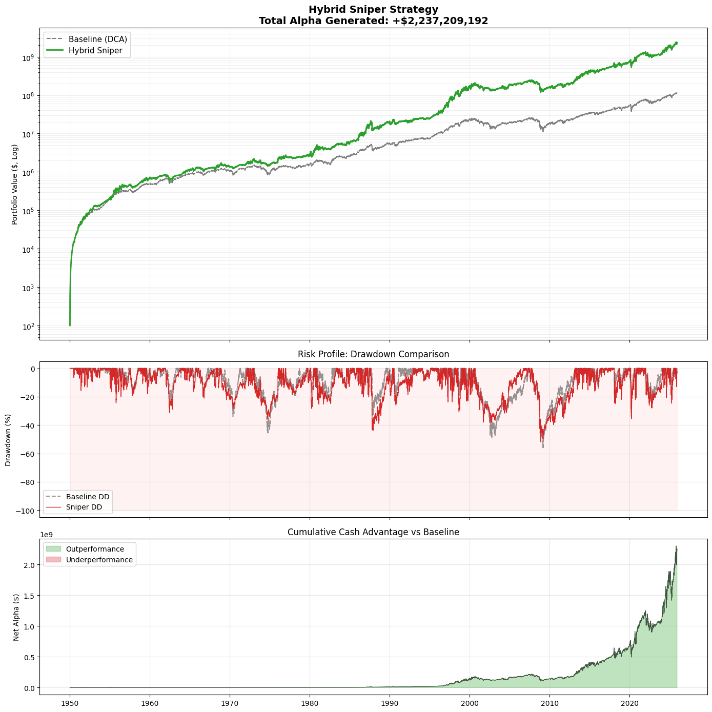
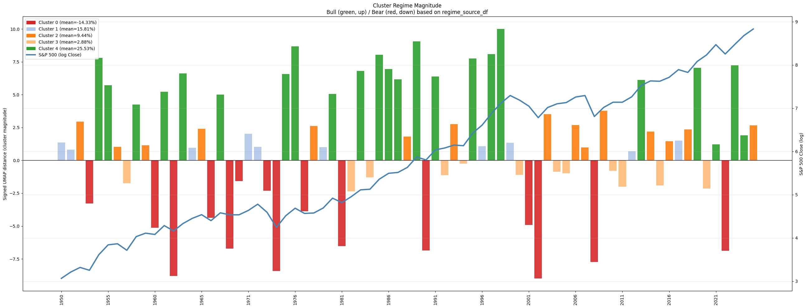

Market Regime Detector

Unsupervised + Supervised Market Regime Detection & Dynamic Portfolio Allocation

⸻

Overview

Market Regime Sniper is an end-to-end research pipeline that identifies, validates, predicts, and exploits market regimes using a combination of:
	•	SSA (trend extraction)
	•	UMAP (non-linear embeddings)
	•	HDBSCAN (density-based clustering)
	•	SVM (regime prediction)
	•	PrefixSpan (sequence mining)
	•	Markov Chain entropy (temporal structure analysis)
	•	Regime-aware portfolio strategy with volatility control

The goal is to uncover structural dynamics in long-horizon equity markets and use them to build systematic allocation logic that adapts to different phases of the market cycle.

⸻

## 🧱 Project Architecture

```text
sp_mapping/
├── notebooks/
│   ├── 01_experiments_clean.ipynb   # Unsupervised regime discovery
│   └── 02_supervised_regimes.ipynb  # SVM regime prediction + entropy
├── src/
│   └── market_regime_sniper/
│       ├── __init__.py
│       ├── data.py
│       ├── pipeline.py          # Unsupervised pipeline runner
│       ├── sniper_strategy.py   # Regime-aware DCA / Hybrid Sniper
│       ├── my_stats.py          # Statistical validation helpers
│       ├── plot.py              # UMAP & regime magnitude plots
│       └── ssa_utils.py         # SSA helpers
├── src/market_regime_sniper/spx.csv  # Sample SPX dataset
├── requirements.txt
├── pyproject.toml
└── README.md
```

⸻

🧠 Methodology Summary

1️⃣ Yearly Trend Geometry

Each trading year is transformed into vectors of consecutive price-movements.
Cosine similarity + vector norms form a compact representation of trend shape and magnitude.

2️⃣ SSA (Singular Spectrum Analysis)

Removes noise and isolates the dominant yearly trend component.

3️⃣ UMAP Embedding

Projects each yearly trend into a non-linear manifold, capturing structural similarity.

4️⃣ HDBSCAN Clustering

Detects robust market regimes such as:
	•	Aggressive Bull
	•	Smart Bull (high Sharpe)
	•	Volatility Shock
	•	Bear

5️⃣ Statistical Regime Validation

Clusters are validated using:
	•	Welch t-test
	•	Mann–Whitney
	•	KS test
	•	Levene
	•	Cohen’s d
	•	Sharpe differential (Memmel)
	•	GRS mean-equality tests

All high-confidence differences (p < 0.01).

6️⃣ Supervised Extension

An SVM (RBF kernel) predicts next-year regime using:
	•	UMAP embeddings
	•	Markov chain entropy (transition uncertainty feature)

7️⃣ Sequence Mining

PrefixSpan extracts frequent regime transition motifs:
	•	SMART_BULL → SMART_BULL → SMART_BULL
	•	BEAR → SMART_BULL
	•	SMART_BULL → BEAR
	•	CL-3 ↔ SMART_BULL

8️⃣ Hybrid Sniper Strategy

A dynamic DCA strategy adjusted by:
	•	Regime detection
	•	Trend check (MA-filter)
	•	Volatility scaling (target vol)

Produces significant long-term outperformance over baseline DCA.

⸻

📈 Performance Snapshot (1950–2025)

Strategy	CAGR	Max Drawdown	Sharpe	Final Equity
Baseline DCA	5.5%	−56%	0.80	1×
Hybrid Sniper	9.4%	−51%	0.84	15×


⸻

▶ Quickstart

Install

pip install -r requirements.txt

Run pipeline

python3 -m market_regime_sniper.pipeline

Explore notebooks

notebooks/
├── 01_experiments.ipynb
└── 02_supervised_regimes.ipynb


⸻

📚 Ideal for
	•	Market regime modeling
	•	Quant/ML research
	•	Systematic signal extraction
	•	Robust long-term portfolio strategies
	•	Time-series clustering & manifold learning

⸻

